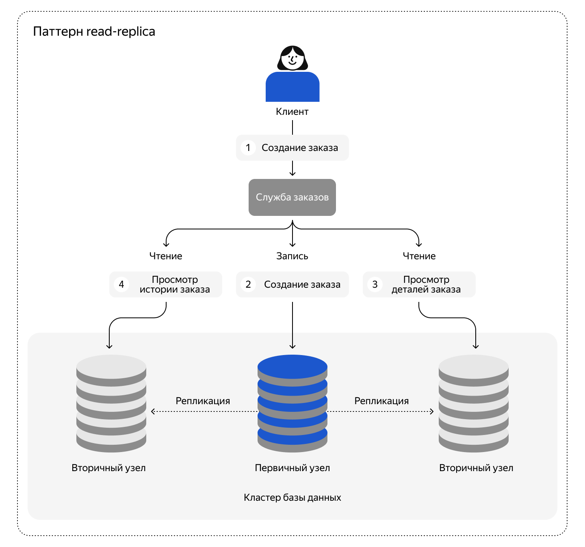
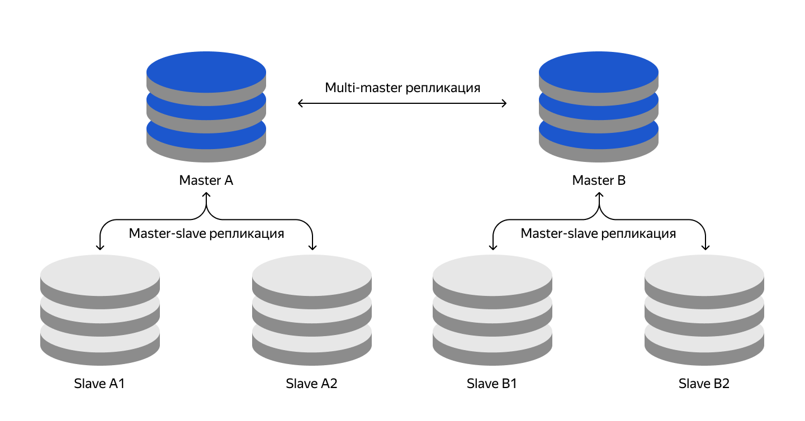
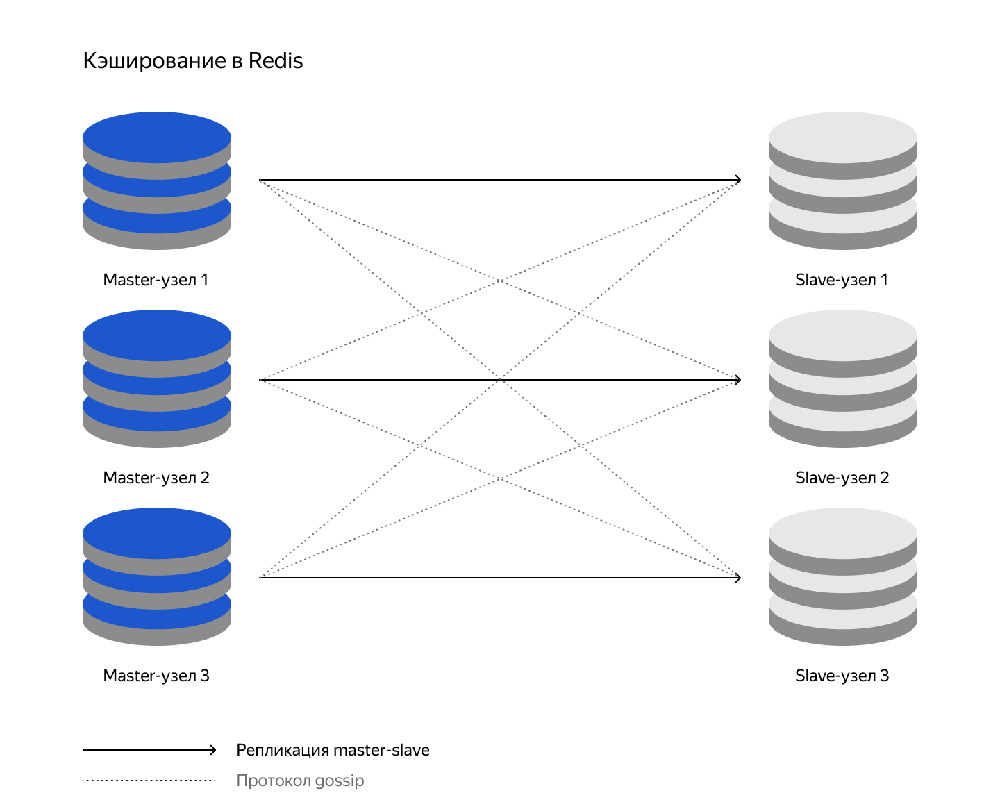
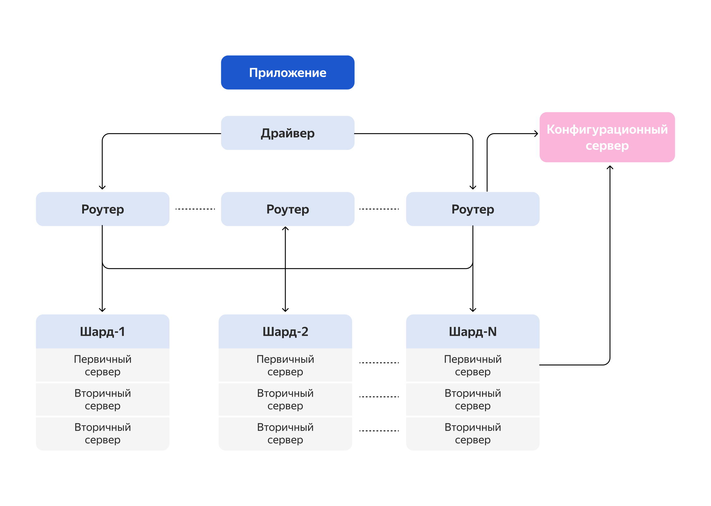

## Реплизация и кеширование






### Репликация mongodb
Листинг команд:  
``` sh
docker-compose -f .\compose.yaml up -d
docker exec -it mongodb-1 mongosh
test> rs.initiate({_id: "rs0", members: [{_id: 0, host: "mongodb1:27017"},{_id: 1, host: "mongodb2:27018"},{_id: 2, host: "mongodb3:27019"}]})
{
  ok: 1,
  '$clusterTime': {
    clusterTime: Timestamp({ t: 1732216337, i: 1 }),
    signature: {
      hash: Binary.createFromBase64('AAAAAAAAAAAAAAAAAAAAAAAAAAA=', 0),
      keyId: Long('0')
    }
  },
  operationTime: Timestamp({ t: 1732216337, i: 1 })
}
rs0 [direct: secondary] test>
```

### Настройка кеширования


[Репозиторий redis-mongo ](https://github.com/db-exp/redis-mongo.git) 

Листинг команд:

```
docker-compose up -d
docker exec -it redis_1
echo "yes" | redis-cli --cluster create   173.17.0.2:6379   173.17.0.3:6379   173.17.0.4:6379   173.17.0.5:6379   173.17.0.6:6379   173.17.0.7:6379   --cluster-replicas 1
redis-cli cluster nodes 
```

## Шардирование в PostgreSQL

В PostgreSQL для шардирования используется сторонний инструмент Citus. Для начала работы с Citus необходимо установить его расширение:  
```
sudo apt-get install postgresql-13-citus 
```
Затем инициализировать Citus:  
```
CREATE EXTENSION citus; 
```

Создать распределённую таблицу:   
```
CREATE TABLE distributed_table (
 id SERIAL,
 data TEXT
);
SELECT create_distributed_table('distributed_table', 'id'); 
```

Добавить рабочие узлы:
```
SELECT citus_add_node('worker_node_address', 5432); 
```

Вставить данные в распределённую таблицу:
```
INSERT INTO distributed_table (data) VALUES ('example_data'); 
```

## Шардирование в MongoDB

Для реализации high-avalability с шардированием рекомендуется:
- Три инстанса роутера
Роутер определяет, на какой шард отправить запрос.
- Три инстанса с конфигурацией
Конфигурационный сервер хранит метаданные кластера, которые содержат информацию о маппинге данных кластера на шарды.
- Три шарда и три реплики для каждого шарда
Шарды используются для хранения данных, каждый шард представляет собой отдельную Replicaset.



Подключение к серверу конфигурации и сделайте инициализацию:
```
docker exec -it configSrv mongosh --port 27017

> rs.initiate(
  {
    _id : "config_server",
       configsvr: true,
    members: [
      { _id : 0, host : "configSrv:27017" }
    ]
  }
);
> exit();
```

Инициализация шардов:
```
docker exec -it shard1 mongosh --port 27018

> rs.initiate(
    {
      _id : "shard1",
      members: [
        { _id : 0, host : "shard1:27018" },
       // { _id : 1, host : "shard2:27019" }
      ]
    }
);
> exit();

docker exec -it shard2 mongosh --port 27019

> rs.initiate(
    {
      _id : "shard2",
      members: [
       // { _id : 0, host : "shard1:27018" },
        { _id : 1, host : "shard2:27019" }
      ]
    }
  );
> exit();
```

Инцициализация роутера и наполнения его тестовыми данными:
```
docker exec -it mongos_router mongosh --port 27020

> sh.addShard( "shard1/shard1:27018");
> sh.addShard( "shard2/shard2:27019");

> sh.enableSharding("somedb");
> sh.shardCollection("somedb.helloDoc", { "name" : "hashed" } )

> use somedb

> for(var i = 0; i < 1000; i++) db.helloDoc.insert({age:i, name:"ly"+i})

> db.helloDoc.countDocuments() 
> exit();
```

Проверка на шардах:
```
 docker exec -it shard1 mongosh --port 27018
 > use somedb;
 > db.helloDoc.countDocuments();
 > exit();

 docker exec -it shard2 mongosh --port 27019
 > use somedb;
 > db.helloDoc.countDocuments();
 > exit();
```